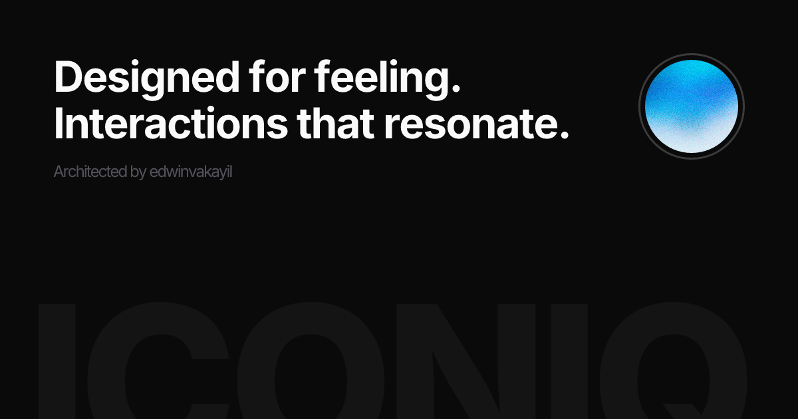

# iconiqui.com

shadcn/ui primitives you own, Subtle motion animations you feel—paste a component, tune the tokens, and ship without the boilerplate hunt.


<br />
<br />
<a href="https://vercel.com/open-source-program">
  
</a>

## Documentation

Visit https://iconiqui.com/installation to view the documentation. 

To access MCP server Visit https://iconiqui.com/mcp .

## Agent skill

```bash
npx skills add https://iconiqui.com --skill iconiq
```

## Contributing

Please read the [contributing guide](/CONTRIBUTING.md).

This project follows the [Code of Conduct](/CODE_OF_CONDUCT.md). By participating, you agree to uphold it.

## License

Licensed under the [MIT license](./LICENSE).

[](https://skills.sh/edwinvakayil/iconiq/iconiq)
